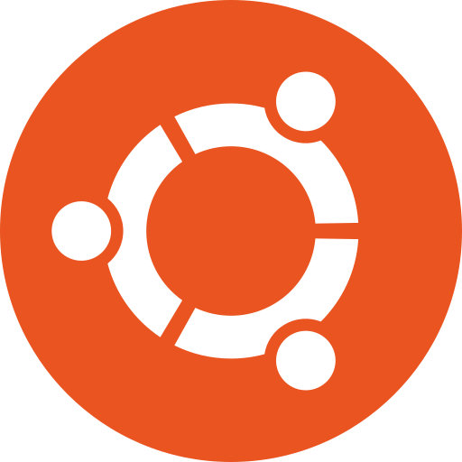
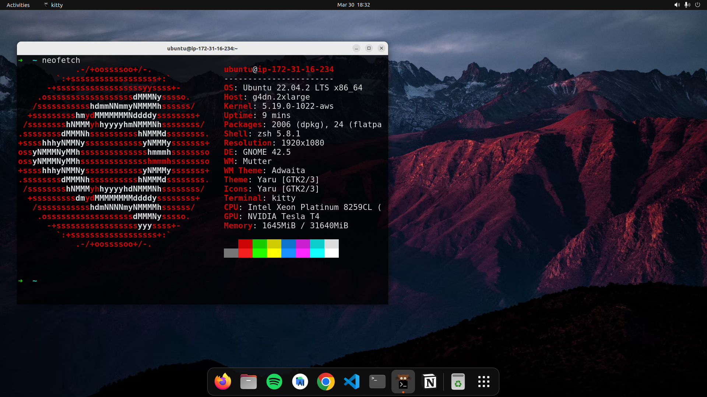
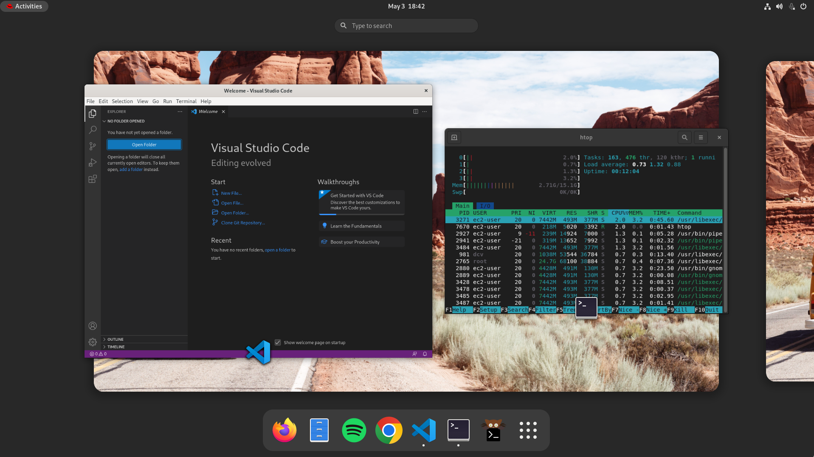

   

  
    
  <h2 align="center">💻 Ultimate AWS Workspace</h2>
  
A developer-friendly, low-latency, Cloud Desktop running on AWS EC2.

  

    
  

 

Current version: **1.0.0**

Lead Maintainer: [Halim Qarroum](mailto:hqm.post@gmail.com)

## 📋 Table of content

- [Features](#-features)
- [Description](#-description)
- [Instance Requirements](./docs/instance-requirements.md)
- [Getting Started](./docs/getting-started.md)
- [Packages](./docs/packages.md)
- [Technical Overview](./docs/technical-overview.md)
- [FAQ](#-faq)
- [Credits](./docs/credits.md)

## 🔖 Features

- 🧑‍💻 **Developer-ready** - Developer oriented Linux and Windows Cloud desktop environment for AWS EC2.
- ⚡ **NiceDCV Integration** - Uses QUIC UDP by default for a low latency 60 FPS experience.
- 🔋 **Battery Included** - Audio + Copy-and-Paste + Microphone + USB devices integration.
- 🦎 **GPU Support** - Supports NVIDIA and AMD GPU acceleration. ([More Information](./docs/technical-overview.md))
- 💻 **Cross-Platform** - Supports latest images based on Ubuntu, AL2, RedHat and Windows Server.
- 🤖 **Automated Deployments** -  Use [Ansible](https://github.com/ansible/ansible) to deploy, and [Packer](https://www.packer.io/) to create AMIs.
- 📦 **Modern Package Management** - Packages based on [Flatpak](https://flatpak.org/) on Linux and [Chocolatey](https://chocolatey.org/) on Windows.
- ☁️ **AWS Integrated** - Integrates with [SSM](https://docs.aws.amazon.com/systems-manager/latest/userguide/ssm-agent.html), [EFS](https://docs.aws.amazon.com/efs/latest/ug/whatisefs.html), [Active Directory](https://docs.aws.amazon.com/directoryservice/latest/admin-guide/what_is.html), [Copilot CLI](https://aws.github.io/copilot-cli/).

## 🔰 Description

The `ultimate-aws-workspace` project aims to provides a way to quickly kickstart a productive, developer-friendly cloud desktop environment on top of EC2 instances with a graphical user interface powered by the low-latency pixel-streaming protocol [NiceDCV](https://aws.amazon.com/hpc/dcv/). This project supports multiple operating-systems based on top of AWS official AMIs.

 
<table align="center">
  <thead>
    <tr>
      <th>Ubuntu</th>
      <th>AL2 (Beta)</th>
      <th>RedHat</th>
      <th>Windows</th>
    </tr>
  </thead>
  <tr>
    <td></td>
    <td></td>
    <td></td>
    <td></td>
  </tr>
</table>
 

An Ansible role is provided to provision new cloud instances with the necessary software to turn them from a server-oriented distribution into a full fledged development environment featuring a graphical user interface and pre-built packages that make development more productive. A Packer template is also provided to build your own AMIs by creating golden images for developers.

 
<table>
  <tr>
    <td>
      
      

<em>Ubuntu</em>

    </td>
    <td>
      
      

<em>RHEL</em>

    </td>
    <td>
      
      

<em>Windows</em>

    </td>
  </tr>
</table>

👉 Head to the [Getting Started](./docs/getting-started.md) guide to kickstart your first deployment.

## 📄 FAQ

**What is `aws-ultimate-workspace` ?**

> The `aws-ultimate-workspace` project provides an automated way through Ansible and Packer to create EC2 images enabling the creation of low-latency, developer-oriented cloud desktops on AWS. The project bundles specific [packages](./docs/packages.md) to produce ready-to-use images including IDEs, programming runtimes, AWS tools, deployment and security packages, and many other niceties to make developer lifes easier. It also provides a graphical user interface on Linux and Windows accessible through [NiceDCV](https://aws.amazon.com/hpc/dcv/) for a low-latency experience and native support for [most GPU configurations on AWS](./docs/technical-overview.md).

**Why did you create `aws-ultimate-workspace` ?**

> Developer experience is one of the most fundamental elements to the productivity of any company developing software. However, fully automating the end-to-end deployment of AMIs for developer cloud desktops with low-latency graphical interfaces, GPU optimizations, pre-baked packages, security built-in and all the required configuration can be time-consuming. I wanted to build on my experience of running instances on AWS to provide the community with optimized images that can be easily managed, customized and re-used.

**How can I deploy `aws-ultimate-workspace` ?**

> To deploy this project, you have the choice of using Ansible to automatically provision existing instances, testing the project, or customizing it. You can also use Packer to create ready-to-use AMIs that can later be launched. For more information, please refer to the [Getting Started](./docs/getting-started.md) guide to deploy `aws-ultimate-workspace` on your instances.

**Should I consider using Amazon Workspaces and Amazon Appstream instead of this project ?**

> Yes, both Amazon Workspaces and Amazon AppStream provide a managed way to run fleet of instances and moving applications with full remote cloud desktops that are well integrated with the AWS ecosystem, and should be considered before using something that is non-managed by nature. The `aws-ultimate-workspace` project provides an alternative way to run cloud desktops on top of bare EC2 instances for particular use-cases. For example, if the instance type does not exist in both Workspaces and AppStream, if the use of tooling to build images for your cloud desktops such as Ansible and Packer is needed, if you want to reduce costs, if you need to have more control over the streaming protocol and installed drivers, or if you have other requirements in terms of regulation or performance that could benefit from a non-managed approach, then this project can help.

**What types of instances are supported ?**

> Please refer the the [Instance Requirements](./docs/instance-requirements.md) documentation to understand the hardware and configuration requirements for running this project.

**What operating systems are supported ?**

> The latest Ubuntu 22.04, Amazon Linux 2 (Beta), RedHat 9 and Windows Server 2022 AWS provided AMIs are currently supported. Amazon Linux 3 is not supported.

**What CPU architectures are supported ?**

> Currently only `x86_64` is actively supported, even if the image could be well supported on ARM architectures. However, due to the lack of compatibility of most of the bundled Flatpaks for ARM, the focus has been put on `x86_64` and ARM is not supported out of the box.

**What's bundled in this deployment ?**

> A combination of productivity and development packages are pre-baked into the built images, along with additional configuration that makes the workspace more user and developer friendly. The [Packages](./docs/packages.md) documentation provides a good overview of what gets installed on the instances. You can of course also review the [Ansible Tasks](./tasks/) to understand how those packages and configuration get applied, and customize them.

**What is the license attached to this project ?**

> This project is distributed under the permissive MIT license, and you can use it and modify it according to your needs. The packages deployed on the instances have each their own licenses, which you will need to review before using this project to ensure they match your usage. For more information, see the [Packages](./docs/packages.md) documentation to see the list of packages used by this project.

**What if I have a problem with an image or something is missing ?**

> Please review first the [Technical Overview](./docs/technical-overview.md) document which provides a list of known issues and potential remediations. You can also [open a new issue](https://github.com/HQarroum/ultimate-aws-workspace/issues/new/choose) if your issue is not within the known issues section or provide a pull request.
