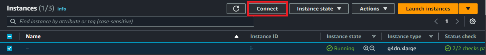
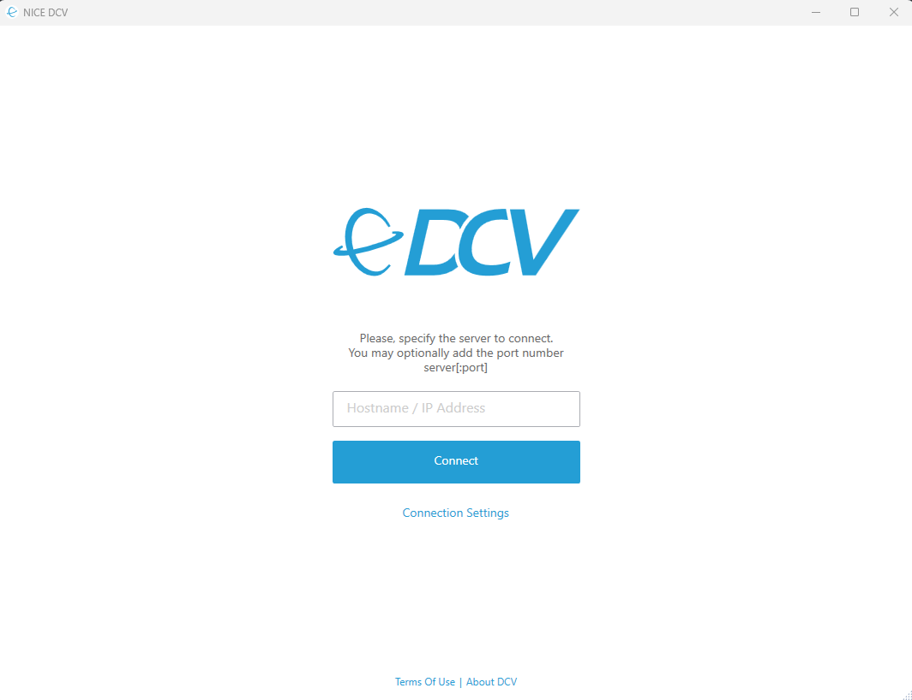
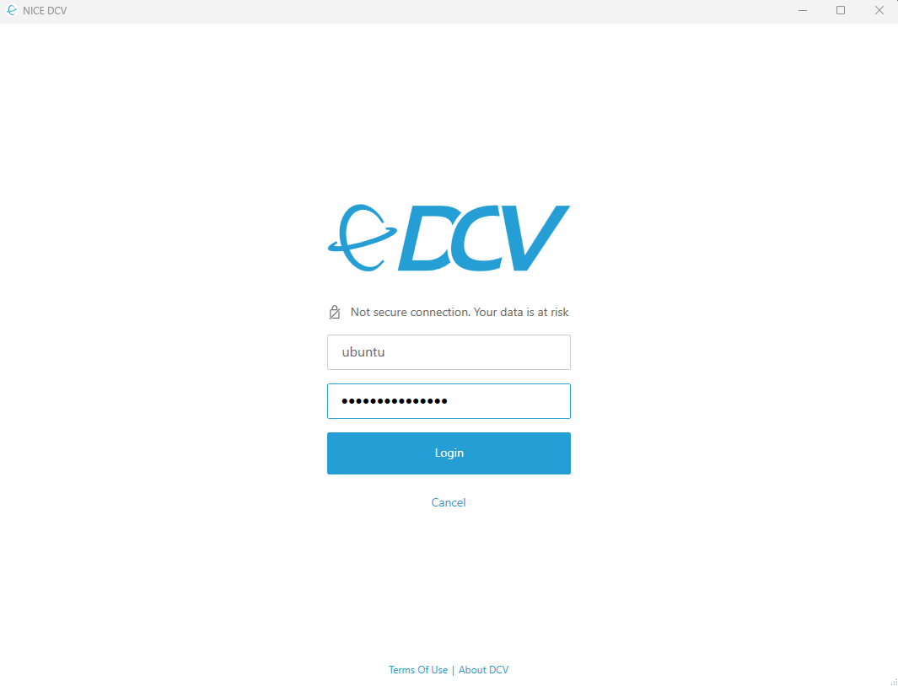
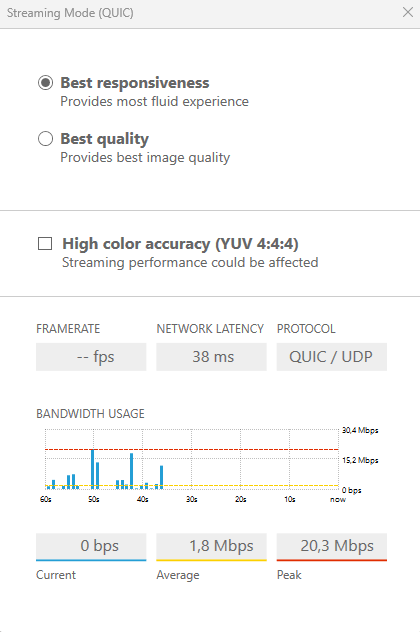

# Getting Started

In this section we will guide you towards deploying `aws-ultimate-workspace` on your instances and access them.

> ⚠️ Before provisioning an instance, please have a look at the [Instance Requirements](../docs/instance-requirements.md) documentation to understand the hardware and configuration requirements for running an EC2 instance as a cloud desktop. You will also need to ensure that AWS credentials are available on the deployment machine as they will be required to install GPU drivers from an AWS S3 bucket.

## 🚀 Deployment

### Using Ansible

When using Ansible, you can clone this repository and create an [Ansible Inventory](https://docs.ansible.com/ansible/2.3/intro_inventory.html) file that will reference the hosts on which you would like to deploy the workspace. This repository comes bundled with an [`inventory.example`](../inventory.example) file that outlines different examples of inventory options for different supported operating systems that you can use as a model.

Once your inventory file is ready, simply deploy to your instances by using the following command.

```bash
ansible-playbook playbook.yml -i /path/to/inventory
```

### Using Packer

Packer is the recommended way if you want to create Amazon Machine Images (AMIs) that are pre-built and ready to deploy to your workspace instances. The [packer](../packer) directory contains different build templates for the supported operating systems. For example, to build an Ubuntu AMI, run the following.

```bash
# Move to the Ubuntu directory.
cd ./packer/ubuntu
# Build the image.
packer build .
```

## 💻 Accessing the Instance

Once an instance has been deployed, how to access the instance will depend on the operating-system you are using.

### Linux

On Linux, the deployment creates a randomly generated password for the main user that is stored in the `~/.password` file that is only accessible by the main user. Depending on the Linux distribution, AWS categorizes the main Linux user as follow.

Operating System | Main user
---------------- | ---------
Ubuntu 22.04     | `ubuntu`
Amazon Linux 2   | `ec2-user`
RedHat 9         | `ec2-user`

You will need to first retrieve the password either by connecting via SSH to the instance, or by using AWS SSM or EC2 Instance Connect from the AWS console for instance using the *Connect* button in the console.

<br />
<p align="center">
  
</p>
<br />

### Windows

For Windows instances, you simply need to decrypt the password instance using the AWS Console.

### NiceDCV Connection

Once you have the password for your instance, you can connect to it using NiceDCV. To do so, first download the [NiceDCV client](https://download.nice-dcv.com/), and enter the DNS name or IP address of your instance in the connection wizard.

<br />
<p align="center">
  
</p>
<br />

Next, enter the credentials for the instance in the NiceDCV prompt. Please refer to the previous section [Accessing the Instance](#-accessing-the-instance) to find out your credentials.

<br />
<p align="center">
  
</p>
<br />

Once connected, it is recommended you update the *Streaming Mode* to *Best responsiveness* and verify that your connection is running over QUIC/UDP by heading into the *Settings* icon and selecting *Streaming Mode*.

<br />
<p align="center">
  
</p>
<br />
